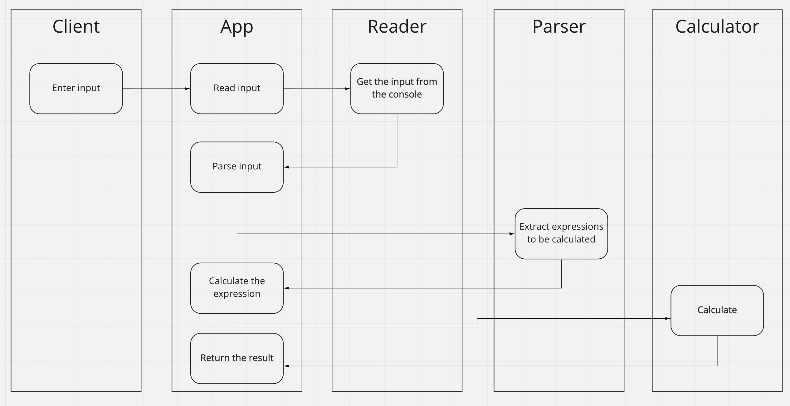

## Documentation

Sequence diagram of the flow:

### Parser

The Parser follows the Shunting-yard algorithm for separating the expression into machine-readable one.
Check the below picture for the algorithm explanation: Or follow the wikipedia link from [SOURCES.md](./SOURCES.md).

