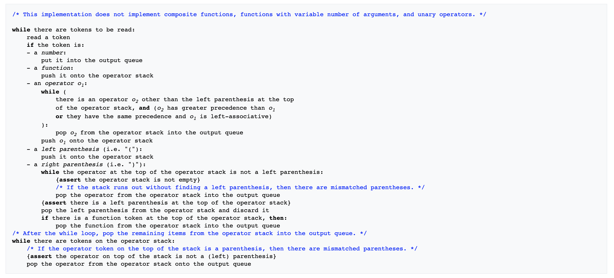

## Documentation

Sequence diagram of the flow:

### Parser

The Parser follows the Shunting-yard algorithm for separating the expression into machine-readable one.
Check the below picture for the algorithm explanation: Or follow the wikipedia link from [SOURCES.md](./SOURCES.md).

### Adding new operator

In order to add new operator follow the flow:

- Add your new operator type under parser/structs.go - OperatorType
- Add the mapping between the character, and the newly created operator type under parser/parser.go - mapStringToOperatorType
- Add the priority of the operator under parser/parser.go - priorities
- Add a function for the way the newly created operator should be evaluated under calculator/calculator.go - operatorCalculation